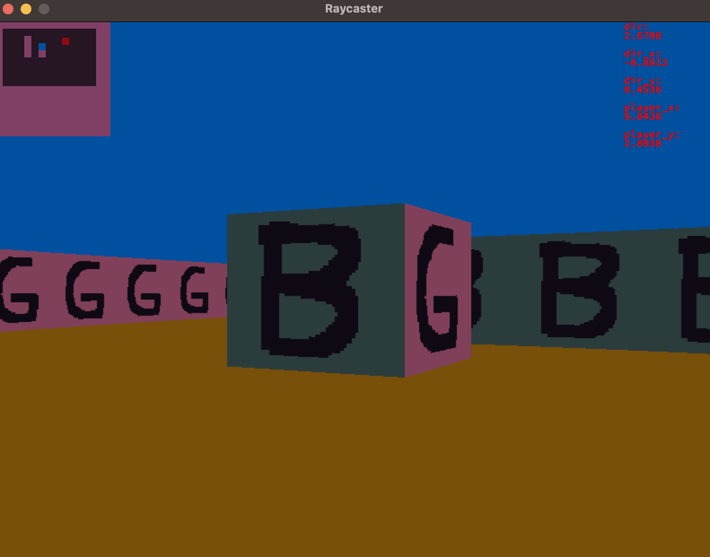
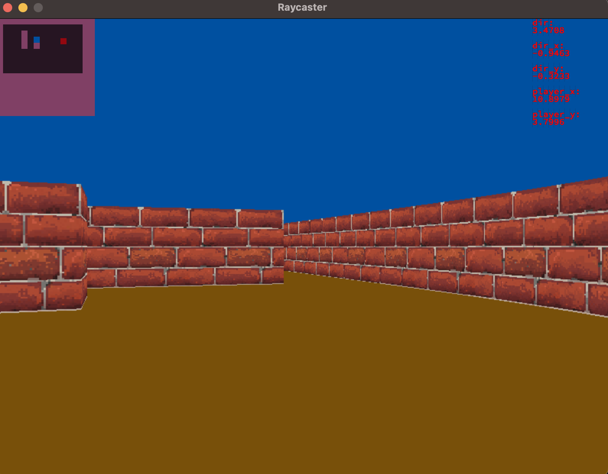

# Cub3d

Type ```make run``` to run it. \
works in MacOs

## Input file

*.cub \
path for textures \
floor and ceiling colors \
map


```txt
NO ./assests/textures/KU.xpm
SO ./assests/textures/GU.xpm
EA ./assests/textures/DO.xpm
WE ./assests/textures/BA.xpm

F 120,80,10
C 0,80,160


      
111111111111111
100000000000001
100010000000001
100010S00000001
100010100000001
100000000000001
100000000000001
100000000000001
100000000000001
111111111111111 
```


## Screenshots




## Useful stuff

[Raycasting from lode](https://lodev.org/cgtutor/raycasting.html)
